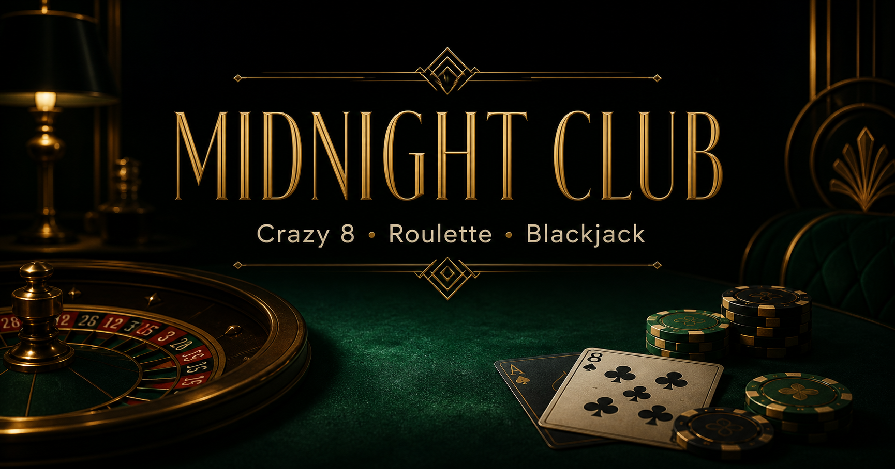

# Midnight Club — Card Arcade

A polished, responsive browser arcade featuring Crazy 8, European roulette, and blackjack. The games use virtual chips only—no account, payment, or real-money gambling is involved.

[Play Midnight Club](https://midnight-club-card-arcade.jacquesvidja.chatgpt.site)



## Games

- **Crazy 8:** Play against the house, match rank or suit, and call a new suit when using an eight.
- **Roulette:** Bet on a single number, red, black, odd, or even. The animated wheel lands on the generated result.
- **Blackjack:** Choose a stake, then hit, stand, or double. The dealer stands on 17 and blackjack pays 3 to 2.

The arcade includes synthesized sound effects with mute and volume controls, animated game feedback, and persistent statistics for rounds, win rate, biggest win, and best streak.

## Visual experience

- Each game has its own lighting, color palette, felt texture, and table atmosphere.
- Cards deal into the table, chips land on bets, and the roulette ball travels around the wheel.
- Wins trigger celebratory particles, while pushes and losses receive distinct visual feedback.
- Immersive mode expands the active table to fill the screen and removes nonessential interface elements.
- Mobile controls stay close to the bottom of the screen for comfortable one-handed play.

Game progress is saved automatically against an anonymous device identifier. Reopening the game restores the bankroll, preferences, statistics, card hands, roulette history, and any active round. No name, email address, or personal profile is collected.

## Run locally

Requirements: Node.js 22.13 or newer.

```bash
npm install
npm run dev
```

Open `http://localhost:3000`.

## Quality checks

```bash
npm run lint
npm run test
npm run build
```

Run all checks together with `npm run check`.

## Project structure

- `app/arcade.tsx` coordinates the three game tables and their interface state.
- `app/game-engine.ts` contains reusable rules, scoring, payouts, and wheel positioning.
- `app/game-engine.test.ts` verifies the important game rules.
- `app/progress-sync.ts` saves and restores the current game snapshot.
- `app/api/progress/route.ts` provides the durable progress API.
- `db/schema.ts` and `drizzle/` define the saved-progress database and migration.
- `app/sound.ts` provides lightweight synthesized game sounds without external media files.
- `app/card-view.tsx` and `app/rules-modal.tsx` contain reusable accessible interface pieces.

## Fair-play note

Cards and roulette outcomes use the browser’s `Math.random()` generator. This is appropriate for this no-money entertainment project, but it is not suitable for regulated or real-money gambling.

## License

[MIT](LICENSE) © 2026 Jacques Vidjanagni.
